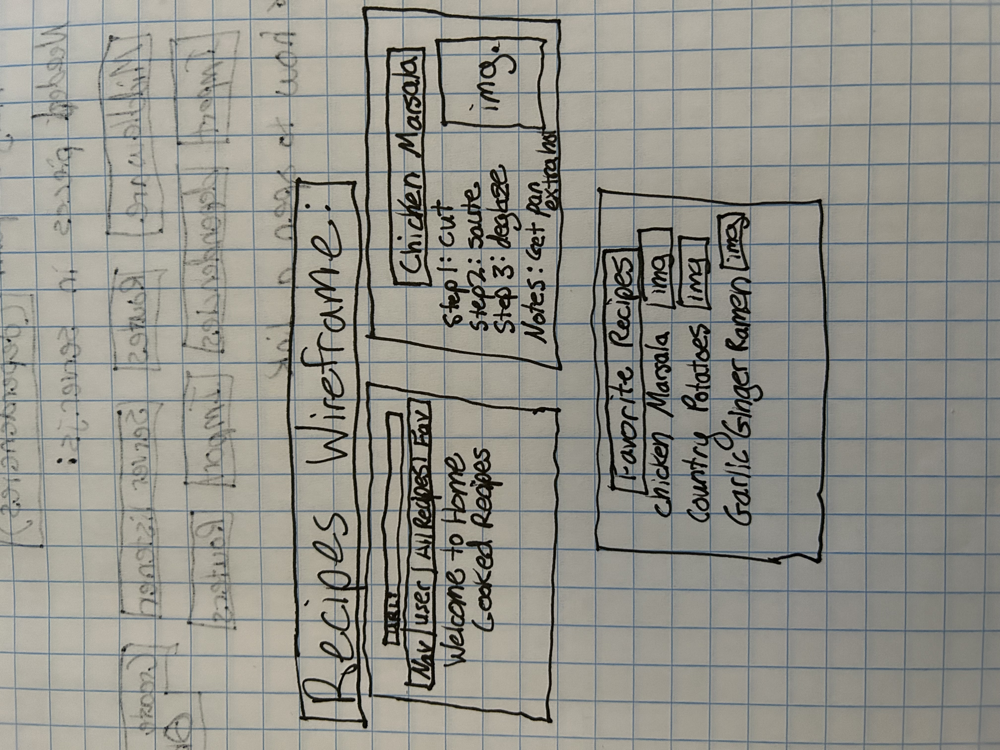
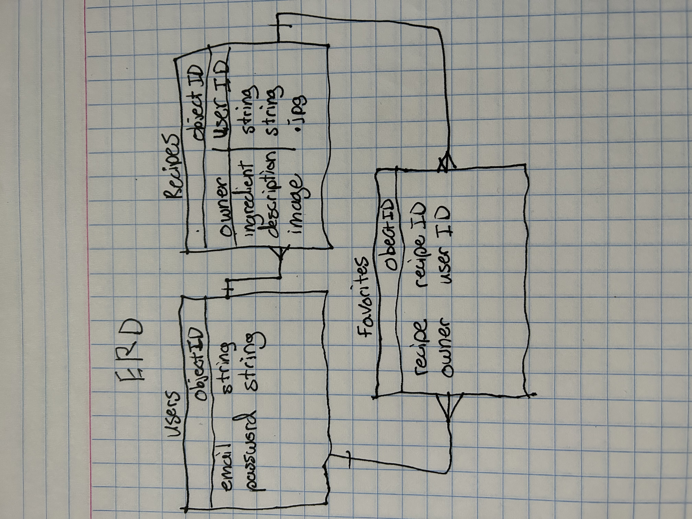

<h1>
// Jack's Classic Recipes- An app that holds a collection of delicious homecooked recipes that allows you to submit your own favorites and to leave a review of others//
</h1>

<h2>
// Technologies used: //
</h2>

Javascript, Express, HTML, CSS, Mongoose Atlas DB

<h2>
// Getting Started //
</h2>

login or signup, then browse the collection of recipes, and leave a review of one you try out at home. If you have a favorite recipe you want to share, add a recipe by clicking on the nav bar and finding the add recipe page, from there you can fill out the required fields and click add recipe. Your recipe will appear in the list of all recipes.

<h2>// Pseudocode //
</h2>

I want to create views that incoroporate a photo of the finished recipe 

I want to create controllers that allow a user to favorite/wishlist their recipes

I want to create controllers that allow the user to signin signup, and logout

I want to import a good navbar

I want to import a authenticator

I want to have dry code that links my modules efficiently

I need to effectively test each stage of the developement process to make sure im debugging with each new addition to the app

I need to establish middleware that communicates to my other modules properly

I need to install all my extensions and check that they are working

I need to create a database of my recipes that the user will have access to, including a photo, description, header, and recipe instructions

I need to have organized ejs files to properly display each page

I need to have organized files in general to easily navigate between my modules

I need to establish my server.js first so I can build upon it like a foundation for the rest of my code

I need to use console logs to check my work often and frequently

I need to have a nav bar item listing all recipes

<h3>
//User Stories//
</h3>

As a user I want to be able to create an account

As a user I want to be able to sign in

As a user I want to be able to view a list of all the recipes with a brief description

As a user I want to be able to click on desired recipe and view it in more detail on a new page

As a user I want to be able to favorite, like, or dislike a recipe

As a user I want to be able to view a list of all my favorited recipes and unfavorite from that new page

As a user I want to be able to view all content on the application and have be well fomatted and centered

As a user I want to be able to enjoy a fluid and proffessional design

As a user I want to be able to sign out

As a user I want to be able to navigate easily through the nav bar

As a user I want to be able to see an error and explanation of what went wrong 

As a user I want to be able to enjoy a great welcome page

<h4>
// Screenshots of App //
</h4>

<h4>
// Wireframe //
</h4>

<h5>
ERD
</h5>

